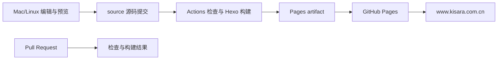

# Kisara 网站自动化与精简改造设计

日期：2026-10-02（Asia/Shanghai）。状态：实施中。

## 项目目标

在保留现有文章、链接、数学公式、Giscus 评论与 Memos 碎碎念的前提下，把个人网站改造成可在 Mac/Linux 上维护、提交源码后自动检查构建和发布、依赖与配置精简且能够回退的 Hexo 博客。

用户已于 2026-10-02 授权开始实施，并追加苹果风格的液态玻璃效果。按阶段验证后推进源码、依赖和发布流程改造。

## 已核对的基线

- 本地根目录：`/Users/kisara/Documents/ChatGPT/个人网站/kisara174.github.io`。
- 源码分支：`source`，提交 `e8a08da56e0d96ffd418f147c649115b29c8702d`。
- 发布分支：`main`，提交 `9862527086803bcfe89ce5b15e1a815892966add`；仓库当前默认分支也是 main。
- Pages：`build_type=legacy`，发布来源为 main 的 `/`，域名为 `www.kisara.com.cn`，HTTPS 已开启。
- `https://kisara.com.cn` 和 HTTP 根域请求均会进入 `https://www.kisara.com.cn/`。
- Hexo 8.1.1、Fluid 1.9.8；8 篇 Markdown 文章。本机 Node 26.10.0/npm 12.2.0 的安装和构建通过，生成 61 个文件、21 个 HTML 页面。
- 本地 HTTP 首页、归档、标签、碎碎念与 custom.css 返回 200。数学公式、评论、Memos 的完整浏览器交互尚未验证。
- 本地 Fluid 有 180 个受跟踪文件，与官方 v1.9.8 发布包相比有 13 个文本文件存在内容差异，另有自定义 CSS、eva.jpg 和 fluid0.png。
- 根目录没有站点构建 workflow；Dependabot 配置在 source 分支中。主题自身的 workflows 不是本站工作流。

这些是规划阶段的观察记录。执行前需要刷新 Git、Pages 和域名状态，不将上述记录当作永久事实。

## 已确定的取舍

1. 保留 Hexo 和 Fluid，沿用静态站点，没有迁移到其他框架或引入 CMS 的需求。
2. 用户明确要求全部移除音乐播放器、Live2D 猫咪和点击文字动画，并清理对应的样式、配置和依赖。
3. 使用 GitHub 官方 Pages artifact 部署流程；源码提交后由云端构建，不再向 main 提交生成网页。
4. source 保持为源码分支，并在上线阶段设为仓库默认分支；旧 main 保留作迁移回退。
5. 正式 URL 使用 `https://www.kisara.com.cn`，保留根域访问及当前跳转关系。迁移不修改 DNS，不更改文章 pathname。
6. 本机和 CI 计划固定 Node 24.21.0 LTS，实施时先验证兼容性；统一 npm/package-lock，固定依赖安装使用 npm ci。
7. 主题迁移先审核差异、迁出个人资产，再验证 npm 管理方式；不能把有用定制当作冗余删除。
8. 自动摘要与标签建议列为后续候选，不纳入本次项目完成条件，不自动改写或发表文章。

## 发布架构

PR 和 source push 执行检查与构建；PR 不部署正式网站。正式部署仅消费通过检查的构建产物，并串行执行；构建任务与发布任务分开设置权限。人工触发只用于明确选择 source 的重新构建，不允许任意分支覆盖正式网站。

迁移分为“先验证 CI 构建”和“再切换 Pages”两步。切换前呈现具体 diff、构建结果与回退步骤。切换后核对正式域名、文章路径、HTTPS 和外部功能；失败时还原 Pages 旧来源，不删除旧 main。

## 精简边界

- 删除：播放器 custom_html、APlayer/Meting 引入、播放器 CSS、Live2D 配置和三项相关直接依赖、点击文字脚本与引入、Landscape 依赖和空配置、统一 npm 后的 yarn.lock。
- 迁移：个人 CSS 和图片进入站点 source；有价值的主题行为差异根据实际使用情况保留为小范围覆盖，或选择已经包含对应修复的正式版本。
- 条件删除：hexo-deployer-git 与 deploy 配置，在 Pages artifact 发布验证通过后删除；source/CNAME 也仅在新流程确认依赖 Pages 域名设置后处理。
- 保留：8 篇正文、现有文章 pathname、评论仓库与映射、搜索、归档、标签、Memos 服务地址、域名与 HTTPS。
- 分类和友链页面已有对外路径，不能仅因导航未显示就认定可删；本计划保留这些路由，不新增栏目。
- 不清空 Git 历史，不删除远端 main，不手工删 Fluid 内部的搜索模板或生成器来减少文件数。

## 自动检查与运行质量

检查从当前源码和生成站点获取真实路由，不自行用日期/文件名重新拼装 permalink。阻止空标题、无效日期、重复路由、缺失本地资源/链接及正式站点元信息里的 example.com。标签缺失作为提示，格式错误才阻断；不把主题样例注释中的 example.com 当成线上错误。

站点时区固定 Asia/Shanghai。updated 明确写入文章时优先使用它，未写入则使用发布日期，不能把 CI checkout 的文件 mtime 当作文章更新时间。现有日期字段和路径通过基线清单对比，不批量重命名文章。

Memos 保持只读公开内容展示。先采用纯文本安全展示、保留换行；增加超时、空列表和接口错误处理。加载状态、无内容、接口不可达分别提示。正文中的 HTML 字符不得进入可执行 HTML；独立服务暂时故障不影响文章阅读，也不阻断静态站点构建。

Dependabot 按周更新，配置 npm 与 GitHub Actions；不无条件自动合并。README 和仓库 AGENTS.md 记录一套入口命令与维护规则；本地工具缓存不加入发布源码。

## 项目完成标准

- [ ] Mac 上从干净检出、固定版本安装依赖后，能够构建和预览。
- [ ] PR 构建和检查通过，且未部署正式网站。
- [ ] source 一次正常提交能够自动发布到现有正式域名。
- [ ] 8 篇文章的现有路径全部保持可访问，典型数学公式、搜索、Giscus 与 Memos 通过浏览器核对。
- [ ] 三类装饰效果及其代码、配置、直接依赖均已清除。
- [ ] 主题资产与个性化配置边界明确，已审核上游差异；npm 主题迁移通过回归后才取代本地主题目录。
- [ ] 缺失资源、重复路径和示例 URL 的故障用例能够使检查失败，并定位到文件或路由。
- [ ] Pages 切换与回退办法已记录，旧 main 保留；发布后源码没有新增生成 HTML 提交。
- [ ] README 说明编辑、预览、检查、发布和恢复步骤。

## 依据

- [GitHub Pages 自定义工作流](https://docs.github.com/en/pages/getting-started-with-github-pages/using-custom-workflows-with-github-pages)
- [GitHub Pages 自定义域名](https://docs.github.com/en/pages/configuring-a-custom-domain-for-your-github-pages-site/managing-a-custom-domain-for-your-github-pages-site)
- [Node 发布状态](https://nodejs.org/en/about/previous-releases)
- [Fluid 上游说明](https://github.com/fluid-dev/hexo-theme-fluid/blob/master/README.md)

执行清单：[网站自动化实施计划](../plans/2026-10-02-website-automation-plan.md)。

## 追加视觉要求：Liquid Glass

保留个人背景图和文章结构，以导航、按钮、搜索浮层和卡片边缘为主要玻璃层；使用 CSS 背景模糊、细腻边框高光、圆角、柔和阴影实现苹果风格的材质感。长文章区域用更实的背景保障公式与文字阅读。支持浅色/深色、手机菜单与键盘焦点；无 backdrop-filter、减少动态/透明度、高对比及打印时回退为清晰的实色界面。不引入 WebGL、跟随鼠标的全屏折射或视觉依赖库。

验收：桌面和 390px 手机视口无横向溢出；导航/搜索/正文可读；深色及减少动态回退有效；玻璃层不遮挡点击，公式和评论可用。
